# 🔗 BookmarkHub

A modern, powerful bookmark manager designed for developers and productivity enthusiasts. BookmarkHub provides an intuitive interface to organize, search, and manage your bookmarks with advanced filtering capabilities.

## 📸 Screenshots

### Theme Variations
<div align="center">

**Light Theme**
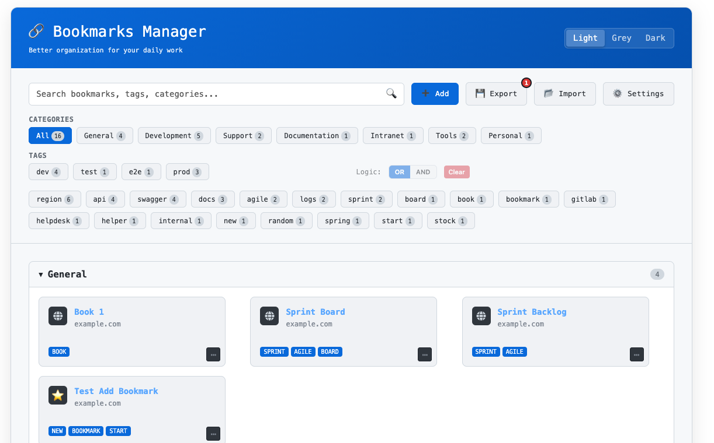

**Dark Theme** 
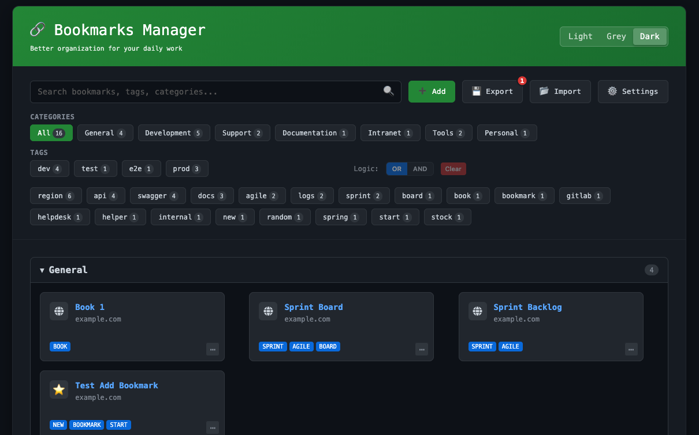

**Grey Theme**
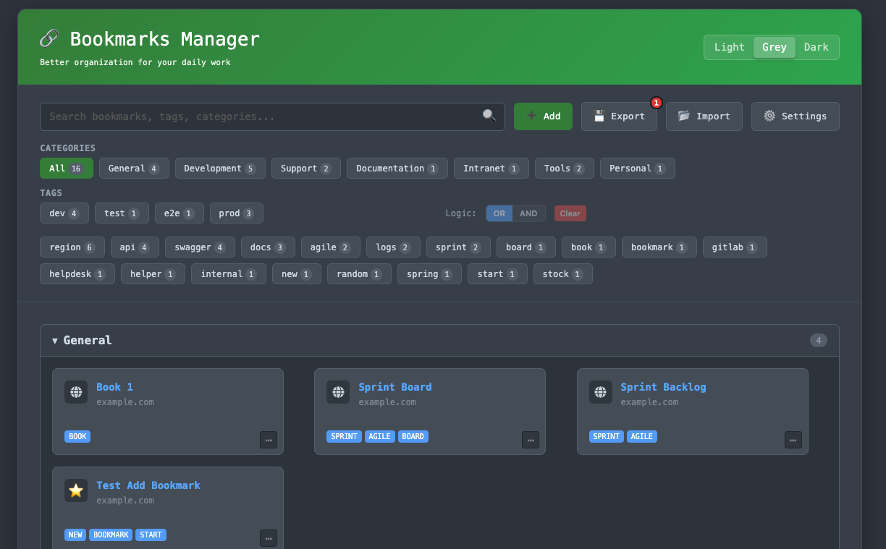

</div>

### Key Features in Action

<div align="center">

**Adding Bookmarks with Icon Selection**
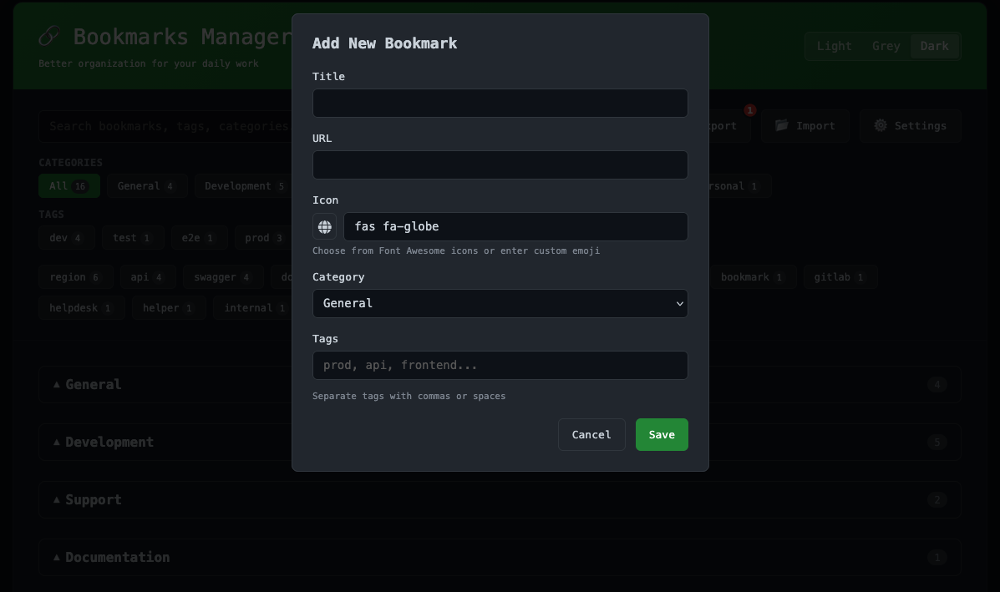

**Advanced Search & Filtering Options**
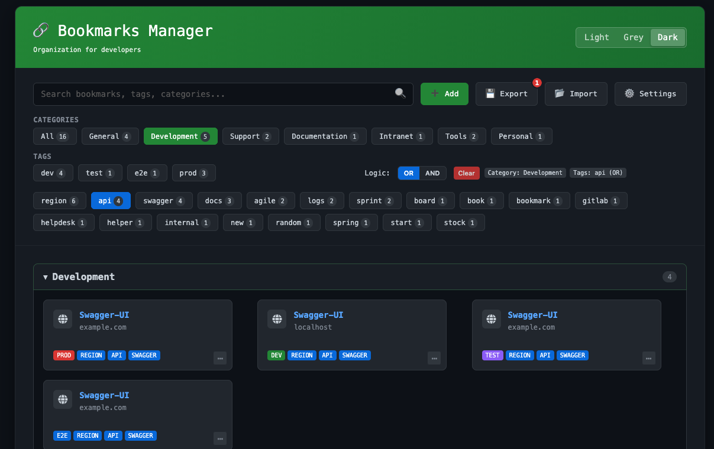

**Customizable Settings**
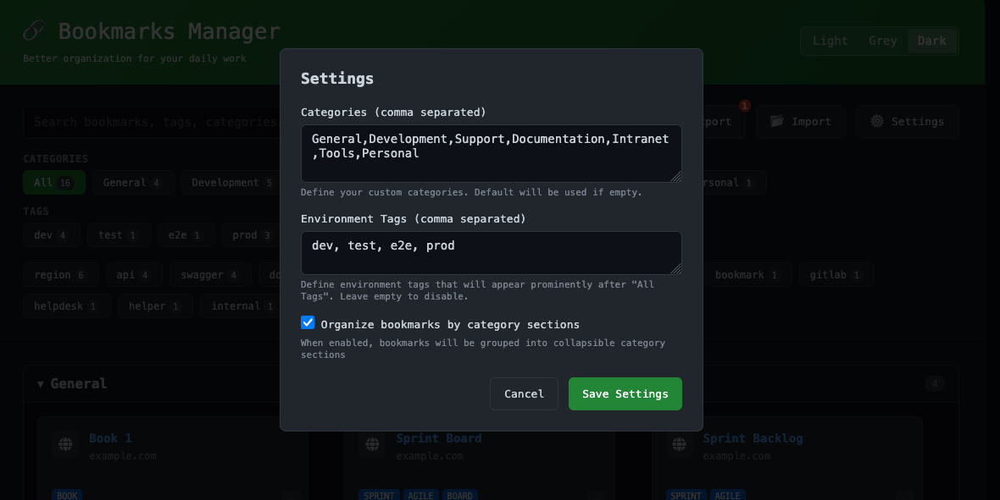

**Organized Category Sections**
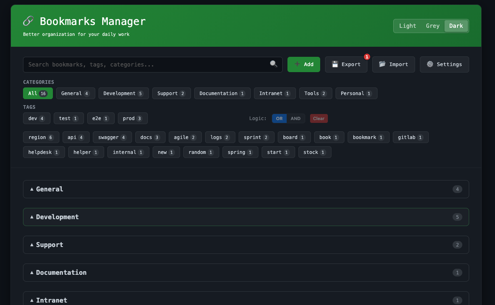

**Widget Sidebar - Expanded View**
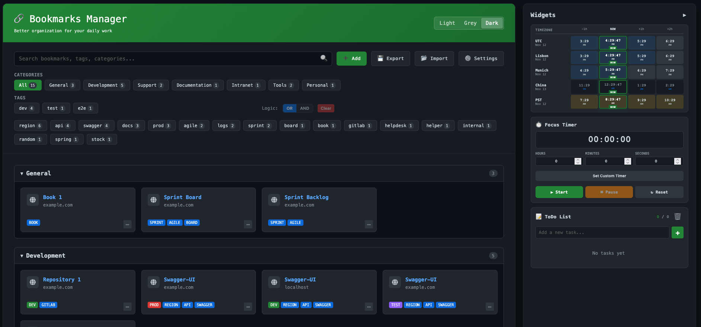

**Widget Sidebar - Collapsed View**
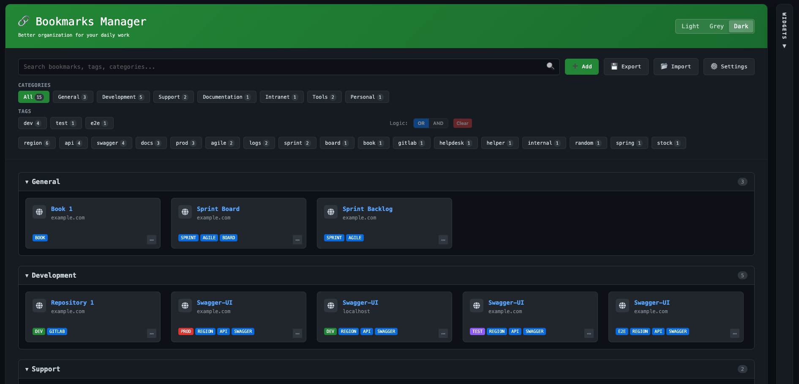

**Widget Settings - Enabled**
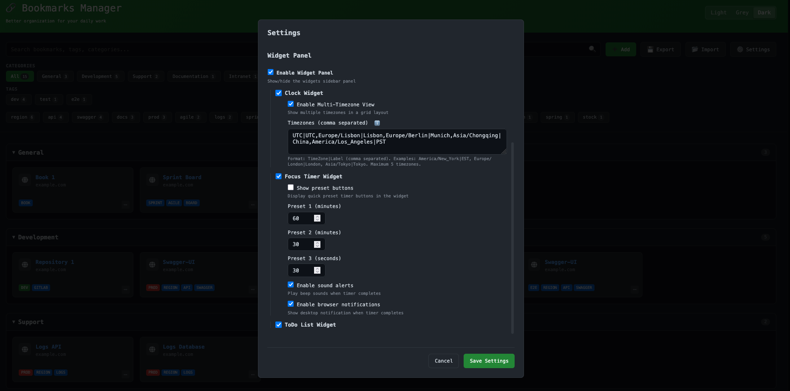

**Widget Settings - Disabled**
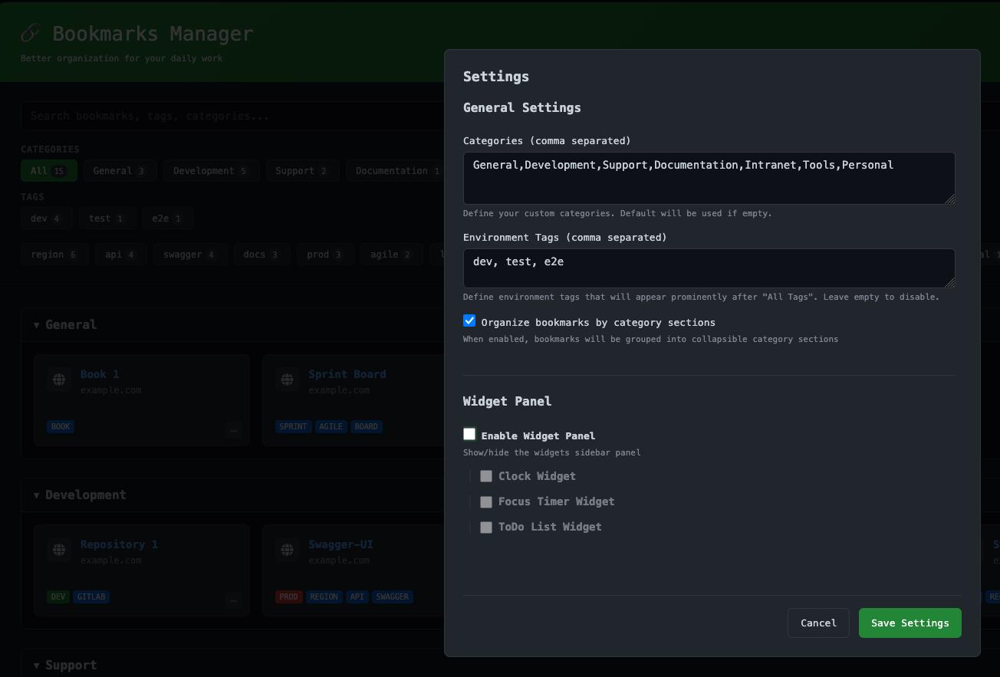

</div>

## ✨ Features

### 🎨 **Multiple UI Themes**
- **Light Theme**: Clean, bright interface for daytime use
- **Dark Theme**: GitHub-inspired dark theme for low-light environments  
- **Grey Theme**: Balanced grey theme for extended use
- Theme preferences are automatically saved

### 📂 **Smart Organization**
- **Categories**: Organize bookmarks into custom categories (General, Development, Support, Documentation, etc.)
- **Tags**: Multi-tag support with environment-specific tags (prod, dev, test, staging)
- **Collapsible Sections**: Optional category-based organization with expandable/collapsible sections

### 🔍 **Advanced Filtering & Search**
- **Intelligent Search**: Search across titles, URLs, categories, tags, and hostnames
- **Category Filtering**: Quick filter by bookmark categories
- **Multi-Tag Filtering**: Filter by multiple tags with AND/OR logic
- **Real-time Filtering**: Instant results as you type
- **Filter Combinations**: Combine search, category, and tag filters

### 🏷️ **Flexible Tagging System**
- **Environment Tags**: Special tags for different environments (production, development, testing)
- **User Tags**: Custom tags for any classification
- **Tag Suggestions**: Auto-complete from existing tags
- **Tag Logic**: Choose between AND/OR logic for multi-tag filtering
- **Visual Tag Indicators**: Color-coded tags for quick identification

### 🎯 **Rich Bookmark Management**
- **Custom Icons**: Choose from Font Awesome, Lucide, Feather icons, or emojis
- **Icon Search**: Find the perfect icon with built-in search
- **Detailed Information**: Store title, URL, category, and multiple tags
- **Quick Actions**: Easy edit and delete options via context menus
- **Bulk Operations**: Clear all filters, export/import functionality

### 📊 **Data Management**
- **YAML Export/Import**: Portable, human-readable bookmark format
- **Local Storage**: All data stored locally in your browser
- **Change Tracking**: Visual indicators for unsaved changes
- **Merge Import**: Import bookmarks without losing existing data
- **Backup Friendly**: Easy export for backup purposes

### 🧩 **Productivity Widgets**
- **Widget Sidebar**: Collapsible side panel for productivity tools
- **Focus Timer**: Pomodoro-style timer with customizable presets, sound alerts, and notifications
- **ToDo List**: Built-in task manager to track your work alongside bookmarks
- **Multi-Timezone Clock**: Display multiple time zones simultaneously (when enabled)
- **Flexible Layout**: Toggle widgets on/off or collapse the sidebar for more bookmark space

### ⚙️ **Customizable Settings**
- **Custom Categories**: Define your own bookmark categories
- **Environment Tags**: Configure which tags appear as environment tags
- **Organization Mode**: Toggle between grid view and category sections
- **Widget Controls**: Enable/disable individual widgets and configure their behavior
- **Timer Presets**: Set custom focus timer durations with sound and notification options
- **Timezone Management**: Add custom timezones with display labels
- **Settings Export/Import**: Save and share your complete settings configuration
- **Persistent Settings**: All preferences saved automatically

## 🚀 Getting Started

### Quick Start
1. Open either `standard-ui.html` or `dark-ui.html` in your web browser
2. Click **"Add"** to create your first bookmark
3. Fill in the title, URL, select a category, and add tags
4. Choose an icon from the comprehensive icon picker
5. Start organizing and filtering your bookmarks!

### Sample Data
The project includes sample files to help you get started:
- **`bookmarks_sample.yaml`**: Example bookmarks demonstrating the organization system
- **`bookmarks_sample_settings.yaml`**: Complete settings configuration including widget preferences, timer presets, and timezone settings

## 🎮 Usage Guide

### Adding Bookmarks
1. Click the **"➕ Add"** button
2. Enter bookmark details:
   - **Title**: Display name for the bookmark
   - **URL**: The web address
   - **Icon**: Choose from 200+ icons or emojis
   - **Category**: Select from predefined or custom categories
   - **Tags**: Add multiple tags (comma or space separated)

### Filtering & Search
- **Search Box**: Type to search across all bookmark data
- **Category Buttons**: Click to filter by specific categories
- **Tag Buttons**: Click tags to add them to active filters
- **Logic Toggle**: Switch between AND/OR logic for tag filtering
- **Clear Filters**: Reset all active filters

### Using Widgets
- **Toggle Sidebar**: Click the collapse/expand button to adjust workspace
- **Focus Timer**: Set custom durations or use presets for focused work sessions
- **ToDo List**: Add, complete, and manage tasks directly in the sidebar
- **Multi-Timezone Clock**: Monitor different time zones at a glance

### Managing Data
- **Export Bookmarks**: Download your bookmarks as a YAML file
- **Export Settings**: Save your complete configuration (categories, tags, widget preferences)
- **Import**: Upload YAML files to restore bookmarks and settings
- **Settings**: Customize categories, tags, widgets, and organization preferences

## 🏗️ Technical Details

### Architecture
- **Single File Application**: Complete functionality in standalone HTML files
- **No Backend Required**: Runs entirely in the browser
- **Local Storage**: Data persistence using browser's localStorage
- **Responsive Design**: Works on desktop and mobile devices

### Icon Libraries
- **Font Awesome**: Comprehensive icon set for web applications
- **Lucide**: Beautiful, customizable icon library
- **Feather**: Simple, clean icon collection
- **Emoji Support**: Native emoji icons for personal touch

### Data Format
Bookmarks and settings are stored and exported in YAML format for easy editing and version control:

**Bookmarks:**
```yaml
Development:
  - Swagger API:
    - https://api.example.com/swagger
    - "Tags: prod, api, documentation | Icon: fas fa-code"
  - GitHub Repository: https://github.com/user/repo
```

**Settings:**
```yaml
Settings:
  categories: "General,Development,Support,Documentation"
  environmentTags: "dev, test, e2e"
  organizeByCategory: true
  enableWidgetPanel: true
  enableClockWidget: true
  enableTimerWidget: true
  enableTodoWidget: true
  timerPreset1: 60
  timerPreset2: 30
  timerSound: true
  timerNotification: true
```

### Browser Compatibility
- Modern browsers with ES6+ support
- Local storage enabled
- JavaScript enabled

## 📁 Project Structure

```
bookmarkhub/
├── standard-ui.html              # Main application with theme switcher
├── dark-ui.html                  # Dark theme variant
├── bookmarks_sample.yaml         # Sample bookmarks for testing
├── bookmarks_sample_settings.yaml # Sample settings configuration
├── images/                       # Screenshots and documentation images
├── LICENSE                       # MIT license
└── README.md                     # This documentation
```

## 🤝 Contributing

Feel free to contribute to BookmarkHub! Whether it's:
- 🐛 Bug reports
- 💡 Feature suggestions  
- 🔧 Code improvements
- 📖 Documentation updates

## 🤖 AI-Powered Development

This project was built with the assistance of cutting-edge AI tools:
- **GitHub Copilot** - Code completion and intelligent suggestions
- **Claude Sonnet 4** - Architecture design and problem-solving

The combination of human creativity and AI assistance enabled rapid development while maintaining high code quality and user experience standards.

## 📄 License

This project is licensed under the MIT License - see the [LICENSE](LICENSE) file for details.

## 🎯 Use Cases

**For Developers:**
- Organize development tools, documentation, and resources
- Separate environments (prod, dev, test) with environment tags
- Quick access to APIs, repos, and monitoring tools
- Use Focus Timer for Pomodoro work sessions
- Track tasks and technical debt with integrated ToDo list

**For Professionals:**
- Manage work-related bookmarks with category organization
- Tag-based filtering for project-specific resources
- Export bookmarks and settings for backup or sharing with team
- Monitor multiple office timezones with multi-timezone clock
- Stay productive with timer and task management widgets

**For Personal Use:**
- Organize personal interests with custom categories
- Visual organization with icons and colors
- Portable data format for easy backup
- Manage personal tasks and time with built-in productivity widgets

---

*BookmarkHub - Better organization for your daily work* 🚀